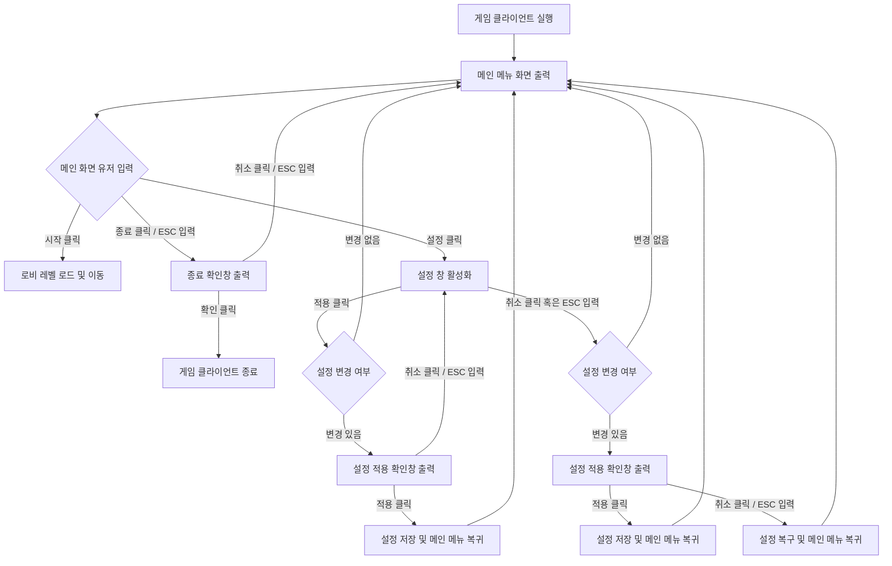

# [기획서] 메인 메뉴 UI

## 1. 개요

- **진행 상태**: 🚧 작성 중
- **대상 플러그인**: `UniversalGameFramework`
- **버전**: 0.1.0
- **작성일**: 2026-05-17
- **설명**: 게임 기동 시 최초로 진입하는 메인 메뉴 화면의 레이아웃, 기능 및 상호작용 명세를 정의합니다.

## 2. UI 구성 요소

### 2.1. 메인 메뉴 화면
| UI 요소명 | UMG 위젯 | 설명 | 스타일 적용 | 표시 텍스트 |
| :--- | :--- | :--- | :--- | :--- |
| 게임 제목 | 텍스트 블록 | 게임의 메인 타이틀을 화면 좌상단 영역에 표시합니다. | `Game Title` | 게임제목 |
| 시작 버튼 | 버튼 | 게임을 시작하여 로비 레벨로 이동하는 이벤트를 처리합니다. | `Primary Solid` | 시작 |
| 설정 버튼 | 버튼 | 설정 창을 화면 최상단 레이어로 활성화합니다. | `Secondary Solid` | 설정 |
| 종료 버튼 | 버튼 | 게임 종료 의사를 확인하는 모달 창을 띄웁니다. | `Secondary Solid` | 종료 |
| 버전 표시 | 텍스트 블록 | 클라이언트의 버전을 화면 우하단에 표시합니다. | `Caption` | Version 0.1.0 |

### 2.2. 종료 확인창
| UI 요소명 | UMG 위젯 | 설명 | 스타일 적용 | 표시 텍스트 |
| :--- | :--- | :--- | :--- | :--- |
| 배경 오버레이 | 경계 | 화면 전체를 흐리게 덮어 백그라운드를 차단합니다. | `Overlay` | - |
| 확인창 패널 | 경계 | 안내 메시지와 확인/취소 버튼이 배치되는 패널 영역입니다. | `Panel` | - |
| 안내 문구 | 텍스트 블록 | 종료 의사를 묻는 텍스트를 출력합니다. | `Body` | 게임을 종료하시겠습니까? |
| 확인 버튼 | 버튼 | 게임 클라이언트를 완전히 종료합니다. | `Primary Solid` | 확인 |
| 취소 버튼 | 버튼 | 확인창을 닫고 메인 메뉴로 포커스를 돌립니다. | `Secondary Outline` | 취소 |

### 2.3. 설정 창
| UI 요소명 | UMG 위젯 | 설명 | 스타일 적용 | 표시 텍스트 |
| :--- | :--- | :--- | :--- | :--- |
| 배경 오버레이 | 경계 | 설정 창 뒤쪽의 메인 메뉴 상호작용을 차단합니다. | `Overlay` | - |
| 설정창 패널 | 경계 | 전체 설정 옵션이 포함된 큰 패널 프레임입니다. | `Panel` | - |
| 타이틀 텍스트 | 텍스트 블록 | 설정 화면의 주요 대분류 제목을 표시합니다. | `Title` | 설정 |
| 탭 버튼 그룹 | 버튼 그룹 | 그래픽, 오디오, 언어 탭을 오갈 수 있는 상단 탭 버튼들입니다. | `Tab` | 그래픽, 오디오, 언어 |
| 콘텐츠 영역 | 위젯 스위처 | 선택된 탭에 대응하는 세부 설정 옵션 화면을 교체 출력합니다. | 없음 | - |
| 옵션 조절 컨트롤 | 콤보 박스 / 체크 박스 / 슬라이더 | 드롭다운 메뉴, 토글스위치, 범위 조절바로 각 설정을 입력받습니다. | `Inset` | - |
| 적용 버튼 | 버튼 | 수정한 설정값들의 변경 내역을 확인하고 임시 저장 절차를 시작합니다. | `Primary Solid` | 적용 |
| 취소 버튼 | 버튼 | 수정한 내용을 적용하지 않고 복구하거나 창을 닫는 절차를 시작합니다. | `Secondary Outline` | 취소 |

### 2.4. 설정 적용 확인창
| UI 요소명 | UMG 위젯 | 설명 | 스타일 적용 | 표시 텍스트 |
| :--- | :--- | :--- | :--- | :--- |
| 배경 오버레이 | 경계 | 설정 창 위에 겹쳐서 표시되며 뒤쪽 제어를 차단합니다. | `Overlay` | - |
| 확인창 패널 | 경계 | 설정 변경 저장 여부를 묻는 작은 확인창 영역입니다. | `Panel` | - |
| 안내 문구 | 텍스트 블록 | 설정이 변경되었음을 알리고 적용 여부를 확인하는 메시지입니다. | `Body` | 적용 클릭 시: 변경된 설정을 적용하시겠습니까? 취소/ESC 시: 저장되지 않은 변경 사항이 있습니다. 이대로 나가시겠습니까? |
| 적용 버튼 (좌측) | 버튼 | 확인창의 긍정 또는 동의 액션을 수행합니다. | `Primary Solid` | 적용 클릭 시: 적용 취소/ESC 시: 예 |
| 취소 버튼 (우측) | 버튼 | 확인창의 부정 또는 보류 액션을 수행합니다. | `Secondary Outline` | 적용 클릭 시: 취소 취소/ESC 시: 아니요 |

## 3. 화면 흐름도

